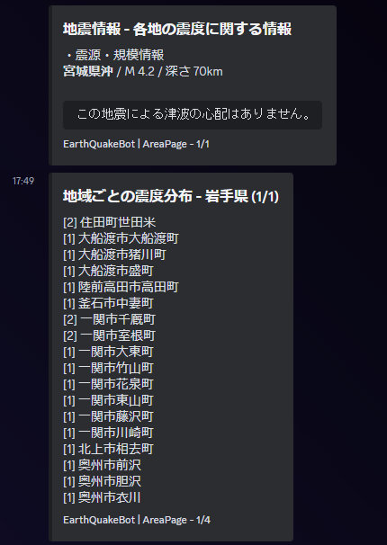
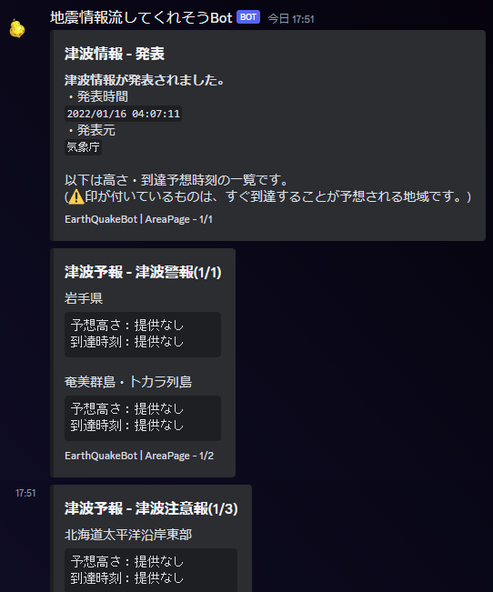
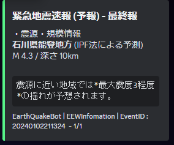

# P2P地震情報の全般的情報を送るBot (仮称)

⏱️`1 min read`

## 開発環境
- TypeScript 5.2.2
- ts-node 10.9.1
- Windows 11

## 使用パッケージ

- p2peq_event 4.0.2 (自作)
- wolfxClient 1.0.0 (自作)
- discord.js 14.14.1

## はじめに

このボットはP2P地震情報 WebSocketAPI から受け取った情報を

複数チャンネルに低遅延で流すことを目標にした物です。

詳しい仕様はコードを見てください。（丸投げ）

## 実行

```
$ npm i 
$ ts-node src/index.ts
```

## Preview

現在対応している情報は、

- 地震情報
- 津波情報
- 緊急地震速報（警報）
- 緊急地震速報（予報）

の4つです。

- 地震情報



- 津波情報



- 緊急地震速報（予報）


